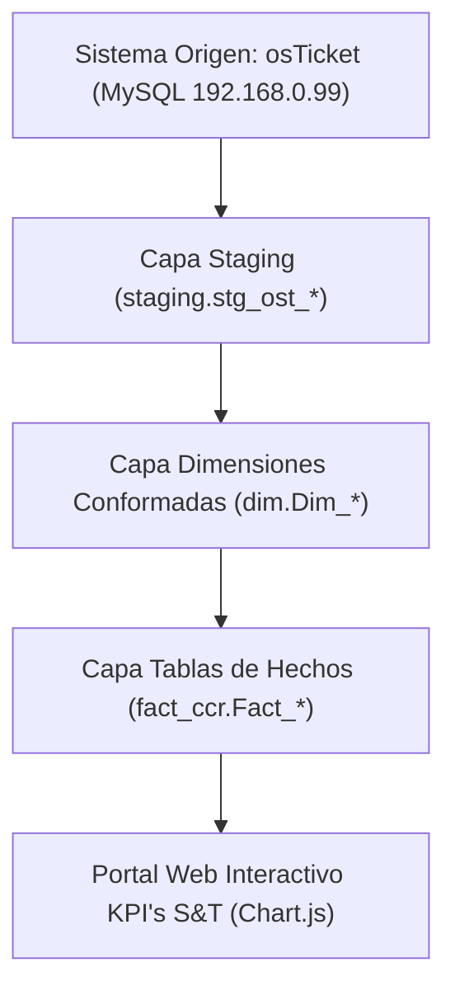

# 💻 KPI's S&T - Data Warehouse & Portal Analítico de Sistemas y Tecnología


Este repositorio contiene la arquitectura completa del **Data Warehouse Empresarial `DW_CCR`**, procedimientos almacenados ETL en SQL Server T-SQL, scripts de ingesta automatizada en Python y el **Portal Web Analítico Interactivo de KPI's S&T (Sistemas & Tecnología)**.

---

## 🔗 Enlaces Oficiales de Producción

- 🌐 **Aplicación Web Desplegada en Vercel**: [https://kpis-st-dashboard.vercel.app](https://kpis-st-dashboard.vercel.app)
- 🐙 **Repositorio Oficial en GitHub**: [https://github.com/IAAsuarez26/KPIS-ST.git](https://github.com/IAAsuarez26/KPIS-ST.git)
- 💻 **Servidor Local**: `http://localhost:8088/`

---

## 📐 Arquitectura del Data Warehouse (`DW_CCR`)



### Modelado Dimensional (Esquema en Estrella OLAP):
- **Capa Staging (`staging`)**: 12 tablas físicas de ingesta limpia (`stg_ost_ticket`, `stg_ost_user`, `stg_ost_organization`, etc.).
- **Dimensiones (`dim`)**: `Dim_Tiempo` (2015 - 2030), `Dim_Organizacion`, `Dim_Usuario_Cliente`, `Dim_Agente_Staff`, `Dim_Departamento`, `Dim_Equipo`, `Dim_Tema_Ayuda`, `Dim_Estado_Ticket`, `Dim_Prioridad_Ticket`, `Dim_SLA`.
- **Tablas de Hechos (`fact_ccr`)**:
  - `Fact_Atencion_Tickets`: 3,157 tickets procesados.
  - `Fact_Eventos_Trazabilidad`: 11,008 eventos de auditoría.
  - `Fact_Interacciones_Conversaciones`: 7,090 registros de mensajes y respuestas.

---

## 🎨 Portal Web Interactivo (KPI's S&T)

Ubicado en la carpeta `dashboard_app/`, incluye:
- **Filtros por Fecha, Año (2017 - 2026) y Mes**.
- **Modos de Comparación Activos**:
  - **YoY (Year over Year)**: Comparación Año Seleccionado vs Año Anterior.
  - **MoM (Month over Month)**: Comparación Mes Seleccionado vs Mes Anterior.
- **Insignias de Variación % y Diferencia en Puntos de SLA**.
- **Módulos de Análisis**:
  1. 🎧 **Atención & KPIs DW_CCR**: Tarjetas KPI, resumen ejecutivo y gráficos de tendencia.
  2. 👥 **Productividad por Agente**: Matriz de carga de trabajo por técnico.
  3. 📑 **Demanda por Categoría**: Desglose por Software de Negocio (Dynamics GP, Accesorios, etc.).
  4. 🛡️ **Gobernanza TI & ETLs**: Auditoría de ejecución de cargas en `staging.ETL_Log_Ejecucion`.

---

## 🛠️ Estructura del Repositorio

```
KPI's S&T/
├── sql/
│   ├── 01_ddl_dw_ccr.sql                   # Definición DDL de esquemas, dimensiones y hechos DW_CCR
│   ├── 02_etl_linked_server_ccr.sql        # Configuración de Linked Server MYSQL_OSTICKET y Staging
│   ├── 03_etl_dimensiones_ccr.sql          # Procedimientos MERGE de carga de Dimensiones
│   ├── 04_etl_fact_tables_ccr.sql          # Procedimientos MERGE de carga de Tablas de Hechos
│   └── 05_etl_orquestacion_diaria_ccr.sql  # Procedimiento Maestro fact_ccr.sp_Ejecutar_ETL_Diario_CCR
├── etl_osticket_dw.py                      # Extractor e Ingestador Python (PyMySQL -> PyODBC)
├── export_dw_ccr_json.py                   # Generador del dataset JSON para el Portal Web
├── analisis_estadistico_kpis_dw_ccr.md     # Informe de Análisis Estadístico e Indicadores
├── dashboard_app/
│   ├── index.html                          # Interfaz HTML5 responsiva de KPI's S&T
│   ├── app.js                              # Lógica de filtros, comparativa YoY/MoM y Chart.js
│   ├── styles.css                          # Estilos Glassmorphism en modo oscuro y claro
│   └── data_dw_ccr.js                      # Dataset extraído en tiempo real desde DW_CCR
└── vercel.json                             # Configuración del proyecto Vercel (kpis-st-dashboard)
```

---

## 🚀 Ejecución de Carga ETL en SQL Server

Para ejecutar la carga diaria directamente desde SSMS:

```sql
USE [DW_CCR];
GO

EXEC fact_ccr.sp_Ejecutar_ETL_Diario_CCR;
GO
```
