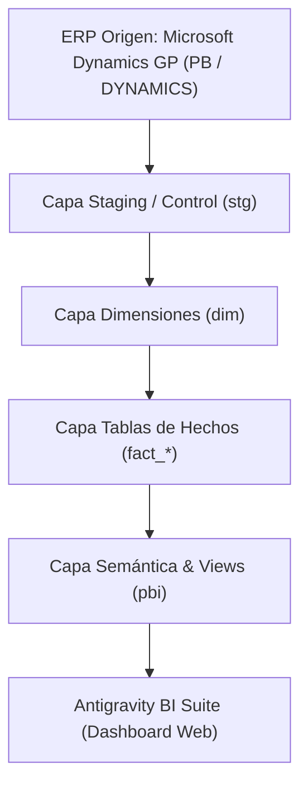

# 🏢 Data Warehouse Empresarial DW_PB & Dashboard Web Interactivo


Este repositorio contiene la arquitectura completa, modelos DDL, procedimientos almacenados ETL y la **Aplicación Web de Dashboards Interactivos (Antigravity BI Suite)** para el Data Warehouse Empresarial **`DW_PB`**, diseñado a partir del ERP Microsoft Dynamics GP.

---

## 📐 Arquitectura del Data Warehouse (DW_PB)



### Esquema y Dimensiones del DW:
- **11 Dimensiones Maestras:** `Dim_Tiempo` (13,149 días), `Dim_Cliente`, `Dim_Proveedor`, `Dim_Producto`, `Dim_Almacen`, `Dim_Cuenta_Contable`, `Dim_Empresa`, `Dim_Usuario`, `Dim_Documento_SOP`, `Dim_Vendedor`, `Dim_Tasa_Cambio`.
- **4 Data Marts Integrados (2.2M+ Filas Processadas):**
  - **`Fact_Ventas_Transaccional`:** 691,138 registros por SKU.
  - **`Fact_Movimientos_Contables`:** 1,448,864 movimientos GL.
  - **`Fact_Entrega_Facturas_Cliente`:** 51,326 despachos.
  - **`Fact_Compras_Ordenes`:** 7,836 órdenes POP.

---

## 🎨 Aplicación Web de Dashboards (Antigravity BI Suite)

Ubicada en la carpeta `dashboard_app/`, incluye:
- **Navegación 360° en 6 Módulos:**
  1. 🌐 **Executive Overview:** Visión ejecutiva consolidad.
  2. 📈 **Ventas y Rentabilidad:** Matriz BCG (Volumen vs. % Margen) y Curva de Pareto 80/20.
  3. 🚚 **Compras y Proveedores:** Fill Rate % y Evaluador de Proveedores.
  4. 💰 **Finanzas y P&L:** Waterfall Chart de Ganancias y Pérdidas y Ciclo de Efectivo.
  5. ⚙️ **Producción y Planta:** Indicador OEE Global %, Yield y Control de Mermas/Scrap.
  6. 📦 **Inventario y Stock:** Valor del Stock, Días de Cobertura (DOH) y Clasificación ABC.
  7. 🛠️ **Gobernanza TI:** Auditoría en tiempo real de `stg.Control_Cargas_ETL`.
- **Conmutador de Moneda USD / VEF:** Recálculo interactivo en tiempo real.
- **Estilo Glassmorphism Modo Oscuro:** Diseñado con la habilidad `ui-ux-pro-max` y **Chart.js**.

---

## 🛠️ Estructura del Repositorio

```
Datawarehouse/
├── sql/
│   ├── 01_ddl_dw_pb.sql                   # Definición de tablas DDL y esquemas DW_PB
│   ├── 02_etl_staging_schemas.sql          # Capa de Staging y Auditoría (stg.Control_Cargas_ETL)
│   ├── 03_etl_dimensiones.sql              # Procedimientos MERGE de carga de Dimensiones
│   ├── 04_etl_fact_tables.sql              # Procedimientos MERGE de carga de Hechos
│   └── 05_etl_orquestacion_diaria.sql      # SP Maestro dbo.sp_ETL_Ejecutar_Carga_Diaria
├── dashboard_app/
│   ├── index.html                          # Interfaz HTML5 responsiva
│   ├── styles.css                          # Hoja de estilos Glassmorphism Modo Oscuro
│   ├── data.js                             # Datasets pre-agregados DW_PB
│   └── app.js                              # Lógica JavaScript y motor Chart.js
├── .agents/                                # Definición de Habilidades y Agentes (.agents/skills)
└── README.md                               # Documentación oficial del repositorio
```

---

## 🚀 Guía de Ejecución Rápida

### 1. Compilación y Ejecución del ETL en SQL Server:
```sql
-- Ejecutar el SP Maestro desde SQL Server Management Studio
EXEC dbo.sp_ETL_Ejecutar_Carga_Diaria @OrigenDB = 'PB', @SystemDB = 'DYNAMICS';
```

### 2. Abrir el Dashboard Web Interactivo:
```powershell
cd dashboard_app
python -m http.server 8080
```
Visita en tu navegador: `http://localhost:8080`

---

## 👤 Autor

* **IAAsuarez26** - *Data Architecture & AI Engineering* - [GitHub Profile](https://github.com/IAAsuarez26)
