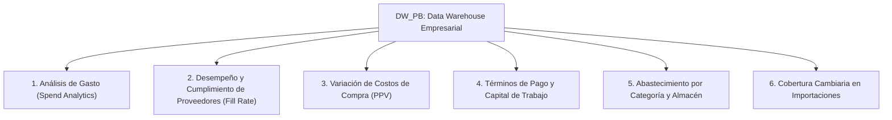

# Blueprint de Analítica Ejecutiva de Compras y Proveedores (DW_PB)

Este documento detalla los **modelos analíticos de mayor impacto estratégico, financiero y logístico para la Gestión de Compras y Proveedores (Procurement Analytics)** derivados de la arquitectura `DW_PB`. Diseñado para la construcción de **Dashboards Ejecutivos de Abastecimiento** (Power BI, Tableau o Aplicaciones Web de Inteligencia de Negocios).

---

## 🎯 Pilares Analíticos Estratégicos de Compras



---

## 📊 1. Pilar de Análisis de Gasto (Spend Analytics & Supplier Pareto)

### KPIs Clave:
- **Gasto Total en Compras ($ USD)**: `SUM(Monto_Total_Orden_USD)`.
- **Gasto Total en Moneda Local (VEF)**: `SUM(Monto_Total_Orden_VEF)`.
- **Órdenes de Compra Emitidas**: `COUNT(DISTINCT PONUMBER)`.
- **Concentración de Gasto (Top Proveedores A)**: % del gasto total concentrado en los principales proveedores.
- **Participación por Origen (Nacional vs. Importación)**: Clasificación de proveedores por RIF/ID (`EXT` Importaciones vs. `J/V` Locales).

### Visualizaciones Sugeridas en Dashboard:
1. **Gráfico de Pareto de Proveedores (Barras + Curva Acumulada %):** Clasificación A, B, C del gasto acumulado en USD.
2. **Mapa de Treemap / Donut:** Distribución del gasto por Clase de Proveedor (`VNDCLTRM`).

---

## 🚚 2. Pilar de Desempeño y Cumplimiento del Proveedor (Fill Rate & OTIF Supplier)

### KPIs Clave:
- **Tasa de Cumplimiento de Pedidos (Fill Rate %)**: `(SUM(Cantidad_Recibida) / SUM(Cantidad_Ordenada)) * 100`.
- **Tasa de Cancelación de Órdenes (%)**: `(SUM(Cantidad_Cancelada) / SUM(Cantidad_Ordenada)) * 100`.
- **Días Promedio de Ciclo de Orden (Lead Time de Compra)**: Promedio de `DATEDIFF(DAY, Tiempo_Orden_SK, Tiempo_Requerido_SK)`.
- **Órdenes con Desviación de Fecha**: Órdenes cuyo despacho superó la fecha requerida (`PRMDATE`).

### Visualizaciones Sugeridas in Dashboard:
1. **Matriz de Evaluación de Proveedores (Scatter Plot / 4 Cuadrantes):** 
   - Eje X: % Fill Rate (Cumplimiento de Cantidad).
   - Eje Y: Gasto Total en $ USD.
   - Tamaño de Burbuja: Cantidad de Órdenes Emitidas.
   - *Finalidad:* Identificar proveedores estratégicos vs. proveedores críticos de bajo rendimiento.

---

## 📉 3. Pilar de Variación de Costos de Compra (Purchase Price Variance - PPV)

### KPIs Clave:
- **Variación de Costo de Compra vs. Costo Estándar (PPV USD)**: `(Costo_Unitario_VEF / Tasa_Cambio_Compras) - STNDCOST`.
- **Variación de Costo de Compra vs. Costo Actual (PPV Actual)**: `(Costo_Unitario_VEF / Tasa_Cambio_Compras) - CURRCOST`.
- **Costo Promedio Ponderado de Adquisición por SKU ($ USD)**.

### Visualizaciones Sugeridas en Dashboard:
1. **Gráfico de Tendencia Temporal (Line Chart):** Evolución del costo unitario en USD por materia prima o producto terminado crítico.
2. **Tabla de Alertas por Inflación / Sobrecosto:** Lista de SKUs donde el precio pagado superó el costo presupuestado en más de un 5%.

---

## 💳 4. Pilar de Términos de Pago y Capital de Trabajo (Working Capital)

### KPIs Clave:
- **Distribución de Gasto por Condición de Pago (`PYMTRMID`)**: % de compras con crédito a 30, 60, 90 días vs. Pago Contado/Anticipado.
- **Volumen de Compras Apalancadas a Crédito**: Total $ USD financiado por proveedores a plazo.
- **Días Promedio de Crédito Otorgado por Proveedor**.

### Visualizaciones Sugeridas en Dashboard:
1. **Gráfico de Barras Apiladas:** Porcentaje del gasto por condición de pago mensual.
2. **Tabla Matriz:** Proveedores principales ordenados por volumen de compra y sus días de crédito.

---

## 🏭 5. Pilar de Abastecimiento por Categoría de Inventario y Almacén

### KPIs Clave:
- **Gasto por Clase de Producto (`ITMCLSCD`)**: Materias Primas, Empaque, Repuestos, Productos Terminados.
- **Gasto por Almacén Destino (`LOCNCODE`)**: Distribución de recepciones por centro de acopio o planta.

### Visualizaciones Sugeridas en Dashboard:
1. **Sankey Diagram / Diagrama de Flujo:** Origen (Proveedor) $\rightarrow$ Categoría de Producto $\rightarrow$ Almacén Destino.

---

## 💵 6. Pilar de Gestión Cambiaria en Compras (FX Exposure)

### KPIs Clave:
- **Tasa de Cambio Promedio Ponderada de Compras (`USD-COMPRAS`)**.
- **Impacto de Volatilidad Cambiaria en el Costo de Adquisición**.

---

## 🛠️ Consultas SQL de Referencia para el Dashboard de Compras

### Consulta 1: Evaluación General y Ranking de Proveedores Top (Spend & Fill Rate)
```sql
SELECT 
    V.VENDORID AS Codigo_Proveedor,
    V.VENDNAME AS Nombre_Proveedor,
    V.VNDCLTRM AS Clase_Proveedor,
    V.PYMTRMID AS Termino_Pago,
    COUNT(DISTINCT C.PONUMBER) AS Total_Ordenes,
    SUM(C.Cantidad_Ordenada) AS Cantidad_Ordenada,
    SUM(C.Cantidad_Recibida) AS Cantidad_Recibida,
    SUM(C.Cantidad_Cancelada) AS Cantidad_Cancelada,
    ROUND((SUM(C.Cantidad_Recibida) / NULLIF(SUM(C.Cantidad_Ordenada), 0)) * 100, 2) AS Porcentaje_Fill_Rate,
    SUM(C.Monto_Total_Orden_USD) AS Gasto_Total_USD,
    ROUND((SUM(C.Monto_Total_Orden_USD) / SUM(SUM(C.Monto_Total_Orden_USD)) OVER ()) * 100, 2) AS Porcentaje_Participacion_Gasto
FROM fact_compras.Fact_Compras_Ordenes C
INNER JOIN dim.Dim_Proveedor V ON V.Proveedor_SK = C.Proveedor_SK
GROUP BY V.VENDORID, V.VENDNAME, V.VNDCLTRM, V.PYMTRMID
ORDER BY Gasto_Total_USD DESC;
```

### Consulta 2: Variación de Precio de Compra por SKU (Purchase Price Variance - PPV)
```sql
SELECT 
    T.Anio,
    T.Mes,
    P.ITEMNMBR AS Codigo_Producto,
    P.ITEMDESC AS Descripcion_Producto,
    P.STNDCOST AS Costo_Estandar_USD,
    AVG(C.Costo_Unitario_VEF / NULLIF(C.Tasa_Cambio_Compras, 0)) AS Costo_Promedio_Real_USD,
    SUM(C.Cantidad_Recibida) AS Cantidad_Total_Recibida,
    SUM(C.Monto_Total_Orden_USD) AS Total_Gasto_USD,
    ROUND(AVG(C.Costo_Unitario_VEF / NULLIF(C.Tasa_Cambio_Compras, 0)) - P.STNDCOST, 4) AS Variacion_Unitario_PPV_USD
FROM fact_compras.Fact_Compras_Ordenes C
INNER JOIN dim.Dim_Tiempo T ON T.Tiempo_SK = C.Tiempo_Orden_SK
INNER JOIN dim.Dim_Producto P ON P.Producto_SK = C.Producto_SK
GROUP BY T.Anio, T.Mes, P.ITEMNMBR, P.ITEMDESC, P.STNDCOST
ORDER BY T.Anio DESC, T.Mes DESC, Total_Gasto_USD DESC;
```
