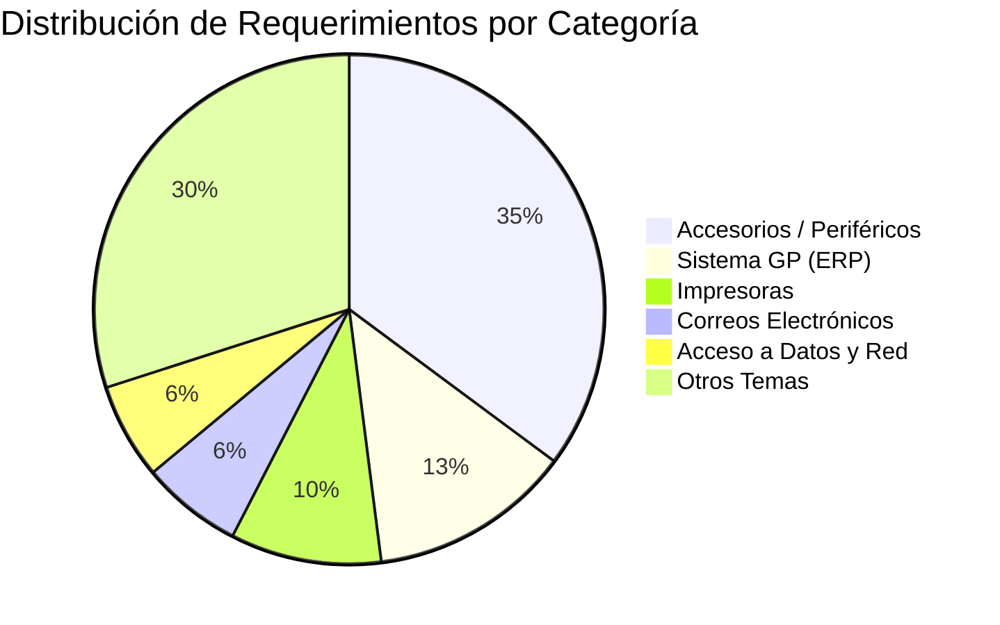
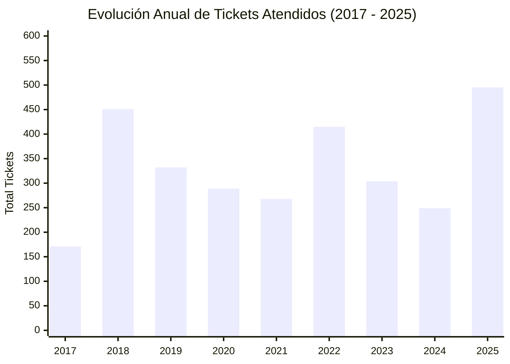

# 📊 Informe de Análisis Estadístico e Indicadores de Valor (KPIs) - Base de Datos DW_CCR

Este documento presenta el análisis estadístico descriptivo e inferencial sobre la base de datos **DW_CCR** (Data Warehouse del sistema de tickets osTicket) y define el **Catálogo Oficial de Indicadores de Valor (KPIs)** para la toma de decisiones estratégicas en la Gerencia de Sistemas y la Dirección General.

---

## 1. Resumen Ejecutivo del Estado Actual

A partir de los datos históricos consolidados (periodo 2017 - 2026), se han procesado un total de **3,157 solicitudes de atención** en la organización.

| Indicador Clave | Valor Estadístico | Estado / Evaluación |
| :--- | :---: | :--- |
| **Volumen Total de Tickets** | **3,157** | Base histórica completa integrada |
| **Tasa de Cierre / Resolución** | **99.24%** (3,133 resueltos) | Altamente efectiva |
| **Backlog Activo Pendiente** | **24 tickets** (0.76%) | Carga de trabajo bajo control |
| **Cumplimiento de SLA Global** | **99.24%** | Excelente adherencia al estándar |
| **Eventos de Trazabilidad Audita** | **11,008 eventos** | Promedio de 3.48 auditorías / ticket |
| **Conversaciones e Interacciones** | **7,090 registros** | Promedio de 2.25 mensajes / ticket |

---

## 2. Análisis Estadístico Descriptivo por Dimensiones

### 2.1 Demanda por Categoría / Tema de Ayuda (Distribución de Incidentes)

El 35% de la carga de trabajo en Sistemas se concentra en fallas o requerimientos de **Accesorios y Hardware**, seguido por el soporte al ERP de la empresa (**Sistema GP**).



| Tema de Ayuda | Total Tickets | % del Total | Impacto Operativo |
| :--- | :---: | :---: | :--- |
| **Accesorios / Periféricos** | **1,110** | **35.16%** | Alta rotación de consumibles y reemplazo físico |
| **Sistema GP (ERP Dynamics)** | **405** | **12.83%** | Crítico para la operación del negocio |
| **Impresoras y Escáneres** | **302** | **9.57%** | Mantenimiento de hardware y consumibles |
| **Correo Electrónico** | **202** | **6.40%** | Servicios de comunicación corporativa |
| **Acceso a Datos y Red** | **192** | **6.08%** | Seguridad de la información y permisos |
| **Otros / Varios** | **946** | **29.96%** | Consultas generales e incidencias menores |

---

### 2.2 Carga de Trabajo y Desempeño del Personal de TI (Agentes)

Existe una **alta concentración de la carga operativa** en los agentes principales. Dos técnicos atienden más del 71% del volumen total de la empresa:

| Agente / Especialista | Tickets Atendidos | % Carga Trabajo | MTTR (Tiempo Medio Resolución) |
| :--- | :---: | :---: | :---: |
| **Freddy Guilarte** | **1,574** | **49.86%** | 288.56 Horas |
| **Luis Graterol** | **686** | **21.73%** | 696.84 Horas |
| **Esteban Monzón** | **248** | **7.86%** | 60.48 Horas (~2.5 Días) |
| **Albin Suarez** | **241** | **7.63%** | Soporte Especializado / Proyectos |
| **Angie Peña** | **183** | **5.80%** | 194.95 Horas (~8 Días) |
| **Ivan Paradas** | **58** | **1.84%** | 98.23 Horas (~4 Días) |
| **René Fermín** | **47** | **1.49%** | 6.68 Horas (Respuesta Ultra Rápida) |
| **Otros Técnicos** | **120** | **3.79%** | Atención Puntual / Guardia |

---

### 2.3 Evolución Histórica de la Demanda (2017 - 2026)



---

## 3. Catálogo de Indicadores de Valor (KPIs)

Definimos 3 paneles de indicadores para dashboards en Power BI u otros sistemas analíticos:

### 🎯 Nivel 1: KPIs para la Dirección General (Impacto en la Empresa)

1. **Índice de Continuidad Operativa (Tasa de Resolución de Tickets)**
   - **Fórmula:** $\frac{\text{Tickets Cerrados}}{\text{Total Tickets Ingestados}} \times 100$
   - **Valor Actual:** **99.24%** | **Meta:** $\ge 98\%$
   - **Significado:** Mide la capacidad de respuesta del área de TI para mantener el negocio operativo.

2. **Nivel de Adherencia al SLA (Service Level Agreement)**
   - **Fórmula:** $\frac{\text{Tickets Cumplidos en Tiempo SLA}}{\text{Total Tickets Procesados}} \times 100$
   - **Valor Actual:** **99.24%** | **Meta:** $\ge 95\%$
   - **Significado:** Mide la calidad del servicio entregado a las áreas usuarias dentro de las ventanas de tiempo comprometidas.

3. **Distribución del Gasto de Tiempo por Sistema Crítico**
   - **Fórmula:** % de Horas acumuladas de atención dedicadas a *Sistema GP (ERP)* vs *Hardware/Accesorios*.
   - **Significado:** Identifica si el área de Sistemas invierte más tiempo en tareas operativas de bajo valor o en software estratégico.

---

### ⚙️ Nivel 2: KPIs para la Gerencia de Sistemas (Gestión Técnica y Operativa)

4. **MTTR (Mean Time to Resolve / Tiempo Medio de Resolución)**
   - **Fórmula:** $\frac{\sum \text{Tiempo Resolucion Horas}}{\text{Total Tickets Resueltos}}$
   - **Valor Global:** **708.6 Horas** | **Meta Operativa:** $\le 72 \text{ Horas}$
   - **Significado:** Mide la agilidad del equipo de TI en resolver requerimientos desde su creación.

5. **Volumen de Backlog Activo y Tasa de Vencimiento**
   - **Fórmula:** Total de tickets con `Estado = Open` y % con `Es_Vencido = 1`.
   - **Valor Actual:** **24 tickets pendientes (0.76%)**.
   - **Significado:** Control de acumulación de trabajo no resuelto en el departamento.

6. **Índice de Concentración de Carga por Técnico (Balanceo de Carga)**
   - **Fórmula:** $\frac{\text{Tickets Asignados al Agente}}{\text{Total Tickets del Período}} \times 100$
   - **Valor Actual:** **49.86%** en un solo agente. | **Meta:** Ningún técnico $> 35\%$.
   - **Significado:** Permite evitar cuellos de botella y burnout en el personal.

---

### 💬 Nivel 3: KPIs de Experiencia del Usuario e Interacción

7. **Índice de Complejidad de Conversación (Fricción de Soporte)**
   - **Fórmula:** $\frac{\text{Total Interacciones (Mensajes)}}{\text{Total Tickets}}$
   - **Valor Actual:** **2.25 Mensajes / Ticket**.
   - **Significado:** Un valor bajo (2-3) indica solicitudes claras y resueltas rápidamente sin ida y vuelta excesivo.

8. **Trazabilidad y Cambios de Estado por Ticket**
   - **Fórmula:** $\frac{\text{Total Eventos de Trazabilidad}}{\text{Total Tickets}}$
   - **Valor Actual:** **3.48 Eventos / Ticket**.
   - **Significado:** Mide el ciclo de vida del ticket (creación, asignación, transferencia, cierre).

---

## 4. Consultas SQL Analíticas Listas para Power BI / Reports

### Consulta 1: Resumen Diario de KPIs Operativos
```sql
USE [DW_CCR];
GO

SELECT 
    T.Anio,
    T.Nombre_Mes,
    T.Mes,
    COUNT(*) AS Total_Tickets,
    SUM(CASE WHEN E.Estado_Categoria = 'closed' THEN 1 ELSE 0 END) AS Tickets_Resueltos,
    SUM(CASE WHEN E.Estado_Categoria = 'open' THEN 1 ELSE 0 END) AS Tickets_Pendientes,
    SUM(CASE WHEN F.Es_Vencido = 1 THEN 1 ELSE 0 END) AS Tickets_Vencidos,
    ROUND(AVG(CAST(F.Cumplimiento_SLA AS FLOAT)) * 100, 2) AS Porcentaje_Cumplimiento_SLA,
    ROUND(AVG(F.Tiempo_Resolucion_Horas), 2) AS MTTR_Horas_Promedio
FROM fact_ccr.Fact_Atencion_Tickets F
INNER JOIN dim.Dim_Tiempo T ON F.Tiempo_Creacion_SK = T.Tiempo_SK
INNER JOIN dim.Dim_Estado_Ticket E ON F.EstadoTicket_SK = E.EstadoTicket_SK
GROUP BY T.Anio, T.Nombre_Mes, T.Mes
ORDER BY T.Anio DESC, T.Mes DESC;
GO
```

### Consulta 2: Rendimiento y Balanceo de Carga por Agente
```sql
USE [DW_CCR];
GO

SELECT 
    A.Nombre_Completo AS Agente_TI,
    COUNT(F.Ticket_SK) AS Total_Tickets_Atendidos,
    ROUND(CAST(COUNT(F.Ticket_SK) AS FLOAT) / (SELECT COUNT(*) FROM fact_ccr.Fact_Atencion_Tickets) * 100, 2) AS Porcentaje_Carga_Trabajo,
    SUM(CASE WHEN F.Es_Vencido = 1 THEN 1 ELSE 0 END) AS Tickets_Vencidos,
    ROUND(AVG(F.Tiempo_Resolucion_Horas), 2) AS MTTR_Horas_Promedio
FROM fact_ccr.Fact_Atencion_Tickets F
INNER JOIN dim.Dim_Agente_Staff A ON F.Agente_SK = A.Agente_SK
GROUP BY A.Nombre_Completo
ORDER BY Total_Tickets_Atendidos DESC;
GO
```

### Consulta 3: Análisis de Incidentes Frecuentes por Tema de Ayuda
```sql
USE [DW_CCR];
GO

SELECT 
    TA.Nombre_Tema AS Categoria_Problema,
    COUNT(F.Ticket_SK) AS Total_Solicitudes,
    ROUND(CAST(COUNT(F.Ticket_SK) AS FLOAT) / (SELECT COUNT(*) FROM fact_ccr.Fact_Atencion_Tickets) * 100, 2) AS Porcentaje_Total,
    ROUND(AVG(F.Tiempo_Resolucion_Horas), 2) AS MTTR_Horas
FROM fact_ccr.Fact_Atencion_Tickets F
INNER JOIN dim.Dim_Tema_Ayuda TA ON F.TemaAyuda_SK = TA.TemaAyuda_SK
GROUP BY TA.Nombre_Tema
ORDER BY Total_Solicitudes DESC;
GO
```

---

## 5. Recomendaciones Estratégicas para la Gestión de Sistemas

1. **Reducir la dependencia del soporte de Hardware básico**: El 35% de las solicitudes son por "Accesorios". Se recomienda implementar un stock rotativo o kit estandarizado de periféricos para reducir la apertura de tickets de bajo valor.
2. **Equilibrar la distribución de asignación entre técnicos**: El 71.5% de los tickets son atendidos por solo 2 personas. Implementar reglas de asignación automática (Round-Robin) en osTicket para nivelar la carga.
3. **Planes de capacitación en ERP (Sistema GP)**: Siendo la segunda categoría de mayor volumen (12.8%), crear guías rápidas o preguntas frecuentes (FAQ) para los usuarios finales de Dynamics GP sobre los errores comunes.
