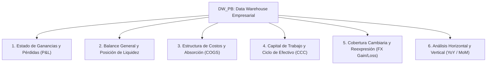

# Blueprint de Analítica Financiera, P&L, Costos y Balance General (DW_PB)

Este documento detalla la arquitectura de **Inteligencia Financiera y Contabilidad de Costos** derivada de la BD `DW_PB`. Diseñado para la construcción de **Dashboards Ejecutivos de Dirección Financiera (CFO Dashboard)** en Power BI, Tableau o Sistemas Web de Reportes OLAP.

---

## 🎯 Pilares Analíticos Financieros Estratégicos



---

## 📊 1. Pilar del Estado de Ganancias y Pérdidas (P&L / Income Statement Analytics)

Construido a partir de los movimientos contables ([fact_finanzas.Fact_Movimientos_Contables](file:///c:/Users/asuarez/Documents/GitHub/Antigravity/Datawarehouse/sql/01_ddl_dw_pb.sql#L350)) vinculados con la dimensión de catálogo de cuentas (`dim.Dim_Cuenta_Contable`).

### Estructura en Cascada del P&L (Income Statement Waterfall):

1. **Ingresos Operativos Brutos (+)**: Cuentas de Ventas / Ingresos.
2. **Devoluciones y Descuentos (-)**: Cuentas de deducción de ventas.
3. **= INGRESOS OPERATIVOS NETOS ($ USD / VEF)**.
4. **Costo de Ventas / COGS (-)**: Costos directos de mercancía vendida y fabricación.
5. **= UTILIDAD BRUTA ($ USD)**.
6. **Gastos Operativos - OPEX (-)**:
   - Gastos de Ventas y Mercadeo.
   - Gastos Administrativos y de Personal.
   - Gastos Operativos Generales.
7. **= EBITDA / UTILIDAD OPERATIVA (EBIT)**.
8. **Gastos / Ingresos Financieros y Diferencial Cambiario (+/-)**.
9. **= UTILIDAD NETA DEL EJERCICIO ($ USD / VEF)**.

### Visualizaciones Sugeridas en Dashboard:
1. **Gráfico de Cascada (Waterfall Chart):** Muestra cómo los ingresos netos se van reduciendo por costos y gastos hasta llegar a la Utilidad Neta.
2. **Análisis Vertical (% sobre Ingresos):** Porcentaje que representa cada rubro del gasto sobre el 100% de las ventas.

---

## 🏛️ 2. Pilar del Balance General y Liquidez (Balance Sheet Analytics)

Supervisa la solvencia, estructura patrimonial y liquidez de la empresa en moneda dura.

### KPIs y Ratios Clave:
- **Activo Total ($ USD)**: Activo Circulante + Activo No Circulante (Fijo).
- **Pasivo Total ($ USD)**: Cuentas por Pagar + Deuda Financiera.
- **Patrimonio Neto ($ USD)**: Capital Social + Reservas + Resultados Acumulados.
- **Ratio de Liquidez Corriente**: `Activo Circulante / Pasivo Circulante` (Meta: > 1.5).
- **Prueba Ácida (Quick Ratio)**: `(Activo Circulante - Inventarios) / Pasivo Circulante` (Meta: > 1.0).
- **Nivel de Endeudamiento (Leverage)**: `Pasivo Total / Activo Total`.

### Visualizaciones Sugeridas en Dashboard:
1. **Gráfico de Estructura de Balance (Barras Apiladas 100%):** Comparativa Activos vs. (Pasivo + Patrimonio).
2. **Medidores de Ratios de Solvencia:** Indicadores de semáforo (Verde / Amarillo / Rojo).

---

## 🔬 3. Pilar de Estructura de Costos y Absorción (Cost Accounting)

Cruza los costos contables de GL (`GL30000`) con los costos de producción y ventas (`SOP30300`).

### KPIs Clave:
- **Desglose de Costos de Fabricación / Servicio**:
  - Materia Prima Directa (MPD).
  - Mano de Obra Directa (MOD).
  - Gastos Indirectos de Fabricación (GIF).
- **Variación de Costos de Absorción**: Comparativa entre el costo presupuestado vs. costo real cargado en contabilidad.
- **Margen de Contribución por Centro de Costos (`CentroCosto_SK`)**.

### Visualizaciones Sugeridas en Dashboard:
1. **Gráfico Donut / Treemap:** Distribución porcentual de los elementos del costo.
2. **Tabla de Variación de Costos:** Comparación mensual presupuestado vs. gastado.

---

## 🔄 4. Pilar de Capital de Trabajo y Ciclo de Conversión de Efectivo (Working Capital & CCC)

Integra las 3 dimensiones operativas del negocio: Cobros, Inventarios y Pagos.

### KPIs Clave:
- **DSO (Days Sales Outstanding - Días de Cobro)**: `(Cuentas por Cobrar / Ventas Totales) * 365`.
- **DIO (Days Inventory Outstanding - Días de Inventario)**: `(Inventario Promedio / Costo de Ventas) * 365`.
- **DPO (Days Payable Outstanding - Días de Pago a Proveedores)**: `(Cuentas por Pagar / Compras Totales) * 365`.
- **Ciclo de Conversión de Efectivo (CCC)**: `CCC = DSO + DIO - DPO`.
  * *Interpretación:* Muestra cuántos días transcurren desde que se paga la materia prima a los proveedores hasta que se recauda el efectivo de las ventas a clientes.

### Visualizaciones Sugeridas en Dashboard:
1. **Tarjeta KPI Integrada del Ciclo de Efectivo:** Muestra los 3 componentes (DSO, DIO, DPO) y el resultado neto del CCC en días.

---

## 💱 5. Pilar de Reexpresión y Cobertura Cambiaria (FX & Bimonetary Analytics)

Evalúa el impacto de la tasa de cambio (`Tasa_Cambio_Financiero` / `USD-FINANCIERO`) en los estados financieros.

### KPIs Clave:
- **Ganancia / Pérdida por Diferencial Cambiario (FX Gain/Loss)**: Resultado del ajuste por reexpresión de cuentas por cobrar y pagar en moneda extranjera.
- **Comparativo P&L en VEF Nominal vs. P&L en $ USD Constante**.

---

## 📈 6. Pilar de Análisis Horizontal y Tendencias (YoY / MoM)

### KPIs Clave:
- **Crecimiento Interanual (YoY - Year over Year)**: Comparativo del mismo mes del año anterior.
- **Variación Mensual (MoM - Month over Month)**: Porcentaje de variación contra el mes inmediato anterior.

---

## 🛠️ Consultas SQL de Referencia para el Dashboard Financiero

### Consulta 1: Estado de Ganancias y Pérdidas Resumido (P&L en $ USD)
```sql
SELECT 
    T.Anio,
    T.Mes,
    T.Nombre_Mes,
    SUM(CASE WHEN C.ACTNUMST LIKE '4%' THEN (F.Monto_Credito_USD - F.Monto_Debito_USD) ELSE 0 END) AS Ingresos_Operativos_USD,
    SUM(CASE WHEN C.ACTNUMST LIKE '5%' THEN (F.Monto_Debito_USD - F.Monto_Credito_USD) ELSE 0 END) AS Costo_de_Ventas_USD,
    SUM(CASE WHEN C.ACTNUMST LIKE '4%' THEN (F.Monto_Credito_USD - F.Monto_Debito_USD) ELSE 0 END) -
    SUM(CASE WHEN C.ACTNUMST LIKE '5%' THEN (F.Monto_Debito_USD - F.Monto_Credito_USD) ELSE 0 END) AS Utilidad_Bruta_USD,
    SUM(CASE WHEN C.ACTNUMST LIKE '6%' THEN (F.Monto_Debito_USD - F.Monto_Credito_USD) ELSE 0 END) AS Gastos_Operativos_OPEX_USD,
    (SUM(CASE WHEN C.ACTNUMST LIKE '4%' THEN (F.Monto_Credito_USD - F.Monto_Debito_USD) ELSE 0 END) -
     SUM(CASE WHEN C.ACTNUMST LIKE '5%' THEN (F.Monto_Debito_USD - F.Monto_Credito_USD) ELSE 0 END) -
     SUM(CASE WHEN C.ACTNUMST LIKE '6%' THEN (F.Monto_Debito_USD - F.Monto_Credito_USD) ELSE 0 END)) AS Utilidad_Neta_USD
FROM fact_finanzas.Fact_Movimientos_Contables F
INNER JOIN dim.Dim_Tiempo T ON T.Tiempo_SK = F.Tiempo_SK
INNER JOIN dim.Dim_Cuenta_Contable C ON C.Cuenta_SK = F.Cuenta_SK
GROUP BY T.Anio, T.Mes, T.Nombre_Mes
ORDER BY T.Anio DESC, T.Mes DESC;
```

### Consulta 2: Estructura del Balance General en $ USD
```sql
SELECT 
    T.Anio,
    T.Mes,
    SUM(CASE WHEN C.ACTNUMST LIKE '1%' THEN (F.Monto_Debito_USD - F.Monto_Credito_USD) ELSE 0 END) AS Total_Activo_USD,
    SUM(CASE WHEN C.ACTNUMST LIKE '2%' THEN (F.Monto_Credito_USD - F.Monto_Debito_USD) ELSE 0 END) AS Total_Pasivo_USD,
    SUM(CASE WHEN C.ACTNUMST LIKE '3%' THEN (F.Monto_Credito_USD - F.Monto_Debito_USD) ELSE 0 END) AS Total_Patrimonio_USD
FROM fact_finanzas.Fact_Movimientos_Contables F
INNER JOIN dim.Dim_Tiempo T ON T.Tiempo_SK = F.Tiempo_SK
INNER JOIN dim.Dim_Cuenta_Contable C ON C.Cuenta_SK = F.Cuenta_SK
GROUP BY T.Anio, T.Mes
ORDER BY T.Anio DESC, T.Mes DESC;
```
