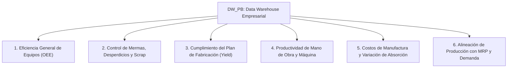

# Blueprint de Analítica Ejecutiva de Producción y Planta (DW_PB)

Este documento detalla la arquitectura de **Inteligencia de Manufactura, Control de Planta y Eficiencia Operativa (Manufacturing & Production Analytics)** derivada del Data Warehouse `DW_PB`. Diseñado para la construcción de **Dashboards Ejecutivos de Operaciones de Planta (VP of Manufacturing / Plant Manager Dashboard)** en Power BI, Tableau o Sistemas Web de Supervisión de Producción.

---

## 🎯 Pilares Analíticos Estratégicos de Producción



---

## 📊 1. Pilar de Eficiencia General de Equipos (OEE - Overall Equipment Effectiveness)

El OEE es el estándar industrial internacional para medir la productividad real de la planta de manufactura.

### Componentes de la Fórmula OEE:
1. **Disponibilidad (%)**: `(Tiempo Operativo Real / Tiempo Operativo Programado) * 100`.
2. **Rendimiento / Desempeño (%)**: `(Unidades Producidas Reales / Unidades Teóricas Estándar) * 100`.
3. **Calidad / Tasa de Conformidad (%)**: `((Cantidad_Producida - Cantidad_Desechada) / Cantidad_Producida) * 100`.
4. **OEE Global (%)**: `Disponibilidad * Rendimiento * Calidad`.

### Visualizaciones Sugeridas en Dashboard:
1. **Medidor / Gauge KPI Integrado:** OEE Global (World Class Benchmark: > 85%).
2. **Desglose de los 3 Factores del OEE:** Disponibilidad (%), Rendimiento (%) y Calidad (%) por Línea de Producción o Almacén.

---

## 🗑️ 2. Pilar de Control de Mermas, Desperdicios y Calidad (Scrap Analytics)

Supervisa las pérdidas de material y el costo de la no calidad en planta.

### KPIs Clave:
- **Tasa de Scrap / Merma (%)**: `(SUM(Cantidad_Desechada) / SUM(Cantidad_Programada)) * 100`.
- **Costo Total de Mermas ($ USD)**: `SUM(Cantidad_Desechada * Costo_Unitario_USD)`.
- **Cantidad Total Producida Conforme**: `SUM(Cantidad_Producida - Cantidad_Desechada)`.
- **Índice de Reproceso (Rework Rate %)**.

### Visualizaciones Sugeridas en Dashboard:
1. **Gráfico de Pareto de Mermas (Barras + Curva Acumulada %):** Top productos o líneas que generan el 80% del desperdicio en planta.
2. **Evolución Mensual de Mermas ($ USD):** Costo financiero del scrap acumulado por mes.

---

## 🎯 3. Pilar de Cumplimiento del Plan de Fabricación (Schedule Attainment & Yield)

Evalúa la disciplina operativa de la planta contra los programas de producción.

### KPIs Clave:
- **Cumplimiento del Plan (% Schedule Attainment)**: `(SUM(Cantidad_Producida) / SUM(Cantidad_Programada)) * 100`.
- **Rendimiento de Producción (Production Yield %)**: `(Cantidad Conforme / Cantidad Programada) * 100`.
- **Órdenes de Fabricación Completadas a Tiempo (% On-Time Completion)**.
- **Tiempo Promedio de Ciclo de Fabricación (Lead Time de Orden)**: `Promedio de DATEDIFF(HOUR, Tiempo_Inicio_SK, Tiempo_Fin_SK)`.

### Visualizaciones Sugeridas en Dashboard:
1. **Gráfico de Barras Comparativo:** Cantidad Programada vs. Cantidad Producida Real por Categoría de Producto.
2. **Status de Órdenes de Fabricación:** Donut chart con distribución por estado (Programadas, En Proceso, Completadas, Retrasadas).

---

## 👷 4. Pilar de Productividad de Mano de Obra y Máquina (Labor & Machine Productivity)

Supervisa el aprovechamiento del recurso humano y tecnológico de la planta.

### KPIs Clave:
- **Eficiencia de Mano de Obra (%)**: `(SUM(Horas_Hombre_Estimadas) / SUM(Horas_Hombre_Reales)) * 100`.
- **Desviación de Horas Hombre (Labor Variance)**: `SUM(Horas_Hombre_Reales - Horas_Hombre_Estimadas)`.
- **Unidades Producidas por Hora Hombre (Productividad MO)**: `Cantidad_Producida / Horas_Hombre_Reales`.
- **Horas Máquina Totales Utilizadas**.

### Visualizaciones Sugeridas en Dashboard:
1. **Gráfico Combinado:** Horas Hombre Estimadas vs. Horas Hombre Reales por Orden de Producción.
2. **Productividad por Turno / Línea:** Unidades producidas por hora de trabajo.

---

## 💰 5. Pilar de Costos de Manufactura y Variaciones de Absorción

Supervisa la composición del costo de producción y su impacto financiero en el P&L.

### KPIs Clave:
- **Costo Total de Producción ($ USD)**: Materia Prima Consumida + Mano de Obra Directa (MOD) + Gastos Indirectos de Fabricación (GIF).
- **Costo Unitario Real de Fabricación por SKU ($ USD)**: `Costo Total de Producción / Cantidad Producida`.
- **Variación de Costo de Fabricación (Actual vs. Estándar)**.

### Visualizaciones Sugeridas en Dashboard:
1. **Gráfico de Estructura de Costos de Planta:** Porcentaje que representan MPD, MOD y GIF dentro del costo industrial.

---

## 🔄 6. Pilar de Alineación de Producción con MRP y Demanda

Conecta las ordenes de producción con el módulo de planificación de demanda ([fact_planificacion.Fact_Planificacion_MRP](file:///c:/Users/asuarez/Documents/GitHub/Antigravity/Datawarehouse/sql/01_ddl_dw_pb.sql#L320)).

### KPIs Clave:
- **Cobertura de Producción vs. Demanda Pronosticada**: `(Cantidad_Producida / Demanda_Pronosticada) * 100`.
- **Riesgo de Desabastecimiento de Producto Terminado (Stockout Risk)**.

---

## 🛠️ Consultas SQL de Referencia para el Dashboard de Producción

### Consulta 1: Resumen de Eficiencia, Cumplimiento y Mermas por Producto
```sql
SELECT 
    P.ITEMNMBR AS Codigo_Producto,
    P.ITEMDESC AS Descripcion_Producto,
    COUNT(DISTINCT OP.MANUFACTURING_ORDER) AS Total_Ordenes_Fabricacion,
    SUM(OP.Cantidad_Programada) AS Cantidad_Programada,
    SUM(OP.Cantidad_Producida) AS Cantidad_Producida,
    SUM(OP.Cantidad_Desechada) AS Cantidad_Desechada_Scrap,
    ROUND((SUM(OP.Cantidad_Producida) / NULLIF(SUM(OP.Cantidad_Programada), 0)) * 100, 2) AS Porcentaje_Cumplimiento_Plan,
    ROUND((SUM(OP.Cantidad_Desechada) / NULLIF(SUM(OP.Cantidad_Programada), 0)) * 100, 2) AS Porcentaje_Merma_Scrap,
    ROUND(((SUM(OP.Cantidad_Producida) - SUM(OP.Cantidad_Desechada)) / NULLIF(SUM(OP.Cantidad_Producida), 0)) * 100, 2) AS Porcentaje_Calidad_Conforme,
    SUM(OP.Horas_Hombre_Estimadas) AS Horas_Hombre_Estimadas,
    SUM(OP.Horas_Hombre_Reales) AS Horas_Hombre_Reales,
    ROUND((SUM(OP.Horas_Hombre_Estimadas) / NULLIF(SUM(OP.Horas_Hombre_Reales), 0)) * 100, 2) AS Eficiencia_Mano_Obra
FROM fact_produccion.Fact_Ordenes_Produccion OP
INNER JOIN dim.Dim_Producto P ON P.Producto_SK = OP.Producto_SK
GROUP BY P.ITEMNMBR, P.ITEMDESC
ORDER BY Cantidad_Producida DESC;
```

### Consulta 2: Cálculo Integrado del OEE por Almacén / Planta
```sql
SELECT 
    A.LOCNCODE AS Codigo_Planta,
    A.LOCNDSCR AS Descripcion_Planta,
    SUM(OP.Cantidad_Programada) AS Programada,
    SUM(OP.Cantidad_Producida) AS Producida,
    SUM(OP.Cantidad_Desechada) AS Scrap,
    -- Factor Calidad = (Producida - Scrap) / Producida
    ROUND(((SUM(OP.Cantidad_Producida) - SUM(OP.Cantidad_Desechada)) / NULLIF(SUM(OP.Cantidad_Producida), 0)) * 100, 2) AS Factor_Calidad_Pct,
    -- Factor Rendimiento = Producida / Programada
    ROUND((SUM(OP.Cantidad_Producida) / NULLIF(SUM(OP.Cantidad_Programada), 0)) * 100, 2) AS Factor_Rendimiento_Pct,
    -- Factor Disponibilidad = Horas Estimadas / Horas Reales
    ROUND((SUM(OP.Horas_Hombre_Estimadas) / NULLIF(SUM(OP.Horas_Hombre_Reales), 0)) * 100, 2) AS Factor_Disponibilidad_Pct,
    -- OEE Global = Calidad * Rendimiento * Disponibilidad
    ROUND((
        ((SUM(OP.Cantidad_Producida) - SUM(OP.Cantidad_Desechada)) / NULLIF(SUM(OP.Cantidad_Producida), 0)) *
        (SUM(OP.Cantidad_Producida) / NULLIF(SUM(OP.Cantidad_Programada), 0)) *
        (SUM(OP.Horas_Hombre_Estimadas) / NULLIF(SUM(OP.Horas_Hombre_Reales), 0))
    ) * 100, 2) AS OEE_Global_Pct
FROM fact_produccion.Fact_Ordenes_Produccion OP
INNER JOIN dim.Dim_Almacen A ON A.Almacen_SK = OP.Almacen_SK
GROUP BY A.LOCNCODE, A.LOCNDSCR;
```
