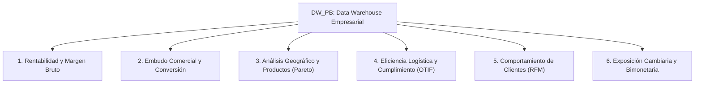

# Blueprint de Analítica Ejecutiva de Ventas (DW_PB)

Este documento detalla los **modelos analíticos de mayor impacto estratégico y financiero** derivados de la arquitectura de Data Warehouse empresarial `DW_PB`. Diseñado para la construcción de **Dashboards Ejecutivos Interactivos** (Power BI, Tableau o Aplicaciones Web de Inteligencia de Negocios).

---

## 🎯 Pilares Analíticos Estratégicos



---

## 📊 1. Pilar de Rentabilidad y Margen Bruto (Profitability Analytics)

### KPIs Clave:
- **Venta Neta Total ($ USD / VEF)**: `SUM(Monto_Neto_USD)` filtrado por `SOPTYPE IN (3, 4)`.
- **Costo de Ventas Total ($ USD)**: `SUM(Costo_Total_USD)`.
- **Margen Bruto en Valor ($ USD)**: `SUM(Margen_Ganancia_USD)`.
- **Porcentaje de Margen Bruto (% Margin)**: `(SUM(Margen_Ganancia_USD) / SUM(Monto_Neto_USD)) * 100`.
- **Erosión de Margen por Descuentos**: `(SUM(Monto_Descuento_VEF) / SUM(Monto_Bruto_VEF)) * 100`.

### Visualizaciones Sugeridas en Dashboard:
1. **Gráfico Combinado (Líneas y Barras):** Evolución mensual de Ventas ($ USD) vs. % Margen de Ganancia.
2. **Matriz BCG de Productos (Scatter Plot 4 Cuadrantes):** 
   - Eje X: Volumen / Cantidad Vendida.
   - Eje Y: % Margen de Ganancia.
   - Tamaño de Burbuja: Venta Neta Total ($ USD).
   - *Cuadrantes:* Productos Estrella, Vacas Lecheras, Oportunidades y Perros/Sub-rentables.

---

## 🛒 2. Pilar de Embudo Comercial y Conversión (Sales Conversion Funnel)

### KPIs Clave:
- **Monto Cotizado (Pipeline Preventa)**: `SOPTYPE = 1` (`DOCID = 'COT'`).
- **Monto en Pedidos Registrados**: `SOPTYPE = 2` (`DOCID = 'PED'`).
- **Monto Facturado Perfeccionado**: `SOPTYPE = 3` (`DOCID = 'FAC'`).
- **Tasa de Conversión (Cotización a Factura)**: `(Facturas / Cotizaciones) * 100`.
- **Tasa de Devolución / Notas de Crédito**: `(Monto NCCS / Monto FAC) * 100`.

### Visualizaciones Sugeridas en Dashboard:
1. **Embudo de Conversión (Funnel Chart):** Cotizado ($) $\rightarrow$ Pedido ($) $\rightarrow$ Facturado ($) $\rightarrow$ Cobrado ($).
2. **Top Razones / Tipos de Nota de Crédito:** Clasificación por `DOCID` (`NCCS` vs. `NCPL`).

---

## 🏆 3. Pilar de Clasificación de Clientes y Productos (Regla de Pareto 80/20)

### KPIs Clave:
- **Clientes Top A (80% del Ingreso)**: Selección acumulada de clientes ordenados descendentemente por Venta Neta USD.
- **Concentración de Ventas (Riesgo de Cliente)**: Porcentaje de facturación concentrado en los Top 10 Clientes.
- **Venta Promedio por Cliente (ARPU)**: `Venta Neta Total / Cantidad de Clientes Activos`.

### Visualizaciones Sugeridas en Dashboard:
1. **Gráfico de Pareto (Barras + Curva Acumulada %):** Clasificación A, B, C de Clientes y Productos.
2. **Mapa de Calor (Heatmap) Almacén vs. Categoría de Producto:** Ventas y rentabilidad por centro de despacho (`Dim_Almacen`).

---

## 🚚 4. Pilar de Eficiencia Logística y Entregas (Fulfilment & OTIF)

### KPIs Clave:
- **Tasa de Entrega a Tiempo (% On-Time)**: `(Entregas sin Retraso / Total Entregas) * 100`.
- **Lead Time Promedio de Despacho**: Promedio de `Dias_Para_Entrega_Factura`.
- **Días Promedio de Desplazamiento de Vencimiento**: Promedio de `Dias_Desplazamiento_Vencimiento`.

### Visualizaciones Sugeridas en Dashboard:
1. **Gauge / Medidor KPI:** % Cumplimiento de Entrega a Tiempo (Meta: > 95%).
2. **Tabla de Desempeño por Repartidor / Usuario:** Días promedio de despacho por `Usuario_Repartidor_SK`.

---

## 👤 5. Pilar de Segmentación de Clientes (Modelo RFM)

### Dimensiones del Modelo RFM:
- **Recencia (R)**: Días transcurridos desde la última compra del cliente.
- **Frecuencia (F)**: Número de transacciones efectivas en el año.
- **Monto (M)**: Total acumulado facturado en USD.

### Segmentos de Clientes Sugeridos:
1. **Campeones (VIP):** Compra reciente, alta frecuencia, alto monto.
2. **Clientes Leales:** Frecuencia constante y buen volumen.
3. **En Riesgo / Inactivos:** Compraban con frecuencia pero no registran facturas en los últimos 90 días.
4. **Nuevos Clientes:** Compra reciente pero baja frecuencia histórica.

---

## 💵 6. Pilar de Gestión Bimonetaria y Tasa de Cambio (FX Impact)

### KPIs Clave:
- **Venta Neta en Moneda Local (VEF)** vs. **Venta Neta en Moneda Dura ($ USD)**.
- **Tasa de Cambio Promedio Ponderada**: `SUM(Monto_Neto_VEF) / SUM(Monto_Neto_USD)`.
- **Evolución del Precio Unitario Promedio en Moneda Dura**.

---

## 🛠️ Consultas SQL de Referencia para el Dashboard

### Consulta 1: Resumen de Rentabilidad Mensual por Categoría de Producto
```sql
SELECT 
    T.Anio,
    T.Mes,
    T.Nombre_Mes,
    P.ITMCLSCD AS Categoria_Producto,
    COUNT(DISTINCT V.SOPNUMBE) AS Cantidad_Facturas,
    SUM(V.Cantidad) AS Unidades_Vendidas,
    SUM(V.Monto_Neto_USD) AS Venta_Neta_USD,
    SUM(V.Costo_Total_USD) AS Costo_Total_USD,
    SUM(V.Margen_Ganancia_USD) AS Margen_Bruto_USD,
    ROUND((SUM(V.Margen_Ganancia_USD) / NULLIF(SUM(V.Monto_Neto_USD), 0)) * 100, 2) AS Porcentaje_Margen
FROM fact_ventas.Fact_Ventas_Transaccional V
INNER JOIN dim.Dim_Tiempo T ON T.Tiempo_SK = V.Tiempo_SK
INNER JOIN dim.Dim_Producto P ON P.Producto_SK = V.Producto_SK
WHERE V.SOPTYPE IN (3, 4) -- Facturas y Devoluciones
GROUP BY T.Anio, T.Mes, T.Nombre_Mes, P.ITMCLSCD
ORDER BY T.Anio DESC, T.Mes DESC, Venta_Neta_USD DESC;
```

### Consulta 2: Análisis de Clientes Top (Clasificación A, B, C)
```sql
WITH VentasCliente AS (
    SELECT 
        C.CUSTNMBR AS Codigo_Cliente,
        C.CUSTNAME AS Nombre_Cliente,
        C.CUSTCLAS AS Clase_Cliente,
        SUM(CASE WHEN V.SOPTYPE = 3 THEN V.Monto_Neto_USD WHEN V.SOPTYPE = 4 THEN -V.Monto_Neto_USD ELSE 0 END) AS Venta_Neta_USD
    FROM fact_ventas.Fact_Ventas_Transaccional V
    INNER JOIN dim.Dim_Cliente C ON C.Cliente_SK = V.Cliente_SK
    WHERE V.SOPTYPE IN (3, 4)
    GROUP BY C.CUSTNMBR, C.CUSTNAME, C.CUSTCLAS
)
SELECT 
    Codigo_Cliente,
    Nombre_Cliente,
    Clase_Cliente,
    Venta_Neta_USD,
    SUM(Venta_Neta_USD) OVER (ORDER BY Venta_Neta_USD DESC) AS Venta_Acumulada_USD,
    ROUND((SUM(Venta_Neta_USD) OVER (ORDER BY Venta_Neta_USD DESC) / SUM(Venta_Neta_USD) OVER ()) * 100, 2) AS Porcentaje_Acumulado
FROM VentasCliente
ORDER BY Venta_Neta_USD DESC;
```
