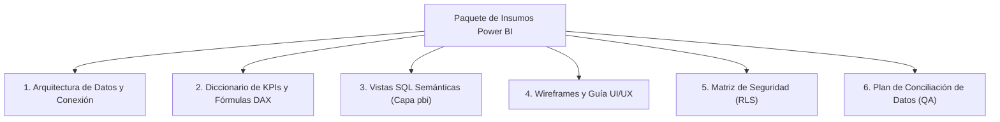

# Paquete de Insumos y Entregables para Proyecto Power BI & Análisis Estadístico (DW_PB)

Este documento detalla el **Paquete Oficial de Insumos Técnicos, Funcionales y Arquitectónicos** que debes entregar al equipo de Desarrollo de Inteligencia de Negocios y Análisis Estadístico para construir la suite de **Dashboards Interactivos en Power BI** sobre la BD `DW_PB`.

---

## 📦 Estructura General del Paquete de Insumos



---

## 🛠️ 1. Arquitectura de Datos y Parámetros de Conexión

### Insumos Técnicos de Conexión:
- **Motor de BD**: Microsoft SQL Server.
- **Servidor / Instancia**: `[Nombre_Servidor_SQL]` (Ej: `localhost` o IP del Servidor de Producción).
- **Base de Datos OLAP**: `DW_PB`.
- **Modo de Almacenamiento en Power BI Recomendado**:
  - **Modo Importación (Import Mode):** Para `Fact_Ventas_Transaccional` (691K filas), `Fact_Compras_Ordenes` (7.8K filas), `Fact_Entrega_Facturas` (51K filas) y todas las **Dimensiones**. *(Garantiza la máxima velocidad de respuesta interactiva)*.
  - **Modo Híbrido / DirectQuery:** Exclusivamente si se requiere refresco en tiempo real para `Fact_Movimientos_Contables` (1.4M filas).

### Diagrama del Modelo de Datos Estrella (Star Schema Map):
Entregar el esquema relacional indicando la relación de `1 a Muchoses` (`1:*`) con dirección de filtro unidireccional desde las dimensiones hacia las tablas de hechos:
- `dim.Dim_Tiempo(Tiempo_SK)` $\rightarrow$ `fact_ventas.Fact_Ventas_Transaccional(Tiempo_SK)`
- `dim.Dim_Cliente(Cliente_SK)` $\rightarrow$ `fact_ventas.Fact_Ventas_Transaccional(Cliente_SK)`
- `dim.Dim_Producto(Producto_SK)` $\rightarrow$ `fact_ventas.Fact_Ventas_Transaccional(Producto_SK)`
- `dim.Dim_Proveedor(Proveedor_SK)` $\rightarrow$ `fact_compras.Fact_Compras_Ordenes(Proveedor_SK)`
- `dim.Dim_Cuenta_Contable(Cuenta_SK)` $\rightarrow$ `fact_finanzas.Fact_Movimientos_Contables(Cuenta_SK)`

---

## 📐 2. Diccionario de KPIs y Librería de Fórmulas DAX

Entregar al desarrollador de Power BI la librería pre-calculada de medidas DAX para garantizar consistencia en los cálculos:

### Ejemplos de Fórmulas DAX Esenciales:

```dax
// 1. Venta Neta Total en USD (Facturas menos Devoluciones)
Venta_Neta_USD = 
CALCULATE(
    SUM(Fact_Ventas_Transaccional[Monto_Neto_USD]),
    Fact_Ventas_Transaccional[SOPTYPE] = 3
) - 
CALCULATE(
    SUM(Fact_Ventas_Transaccional[Monto_Neto_USD]),
    Fact_Ventas_Transaccional[SOPTYPE] = 4
)

// 2. Margen Bruto Porcentual (% Gross Margin)
Porcentaje_Margen_Bruto = 
DIVIDE(
    SUM(Fact_Ventas_Transaccional[Margen_Ganancia_USD]),
    [Venta_Neta_USD],
    0
)

// 3. Fill Rate de Compras (%)
Fill_Rate_Compras_Pct = 
DIVIDE(
    SUM(Fact_Compras_Ordenes[Cantidad_Recibida]),
    SUM(Fact_Compras_Ordenes[Cantidad_Ordenada]),
    0
) * 100

// 4. Días de Cobertura de Inventario (DOH)
Dias_Cobertura_DOH = 
DIVIDE(
    SUM(Fact_Snapshot_Inventario_Diario[Costo_Total_USD]),
    [COGS_Diario_Promedio_90D],
    0
)

// 5. Utilidad Neta Contable en USD (P&L)
Utilidad_Neta_USD = 
CALCULATE(
    SUM(Fact_Movimientos_Contables[Monto_Credito_USD]) - SUM(Fact_Movimientos_Contables[Monto_Debito_USD]),
    Dim_Cuenta_Contable[ACTNUMST] SYNTAXLIKE "4%"
) - 
CALCULATE(
    SUM(Fact_Movimientos_Contables[Monto_Debito_USD]) - SUM(Fact_Movimientos_Contables[Monto_Credito_USD]),
    Dim_Cuenta_Contable[ACTNUMST] SYNTAXLIKE "5%" OR Dim_Cuenta_Contable[ACTNUMST] SYNTAXLIKE "6%"
)
```

---

## 🗄️ 3. Capa de Vistas SQL Semánticas (Capa `pbi`)

Para evitar que cambios físicos en la base de datos rompan el informe de Power BI, se recomienda entregar Vistas SQL dedicadas en un esquema `pbi`:

```sql
USE [DW_PB];
GO

IF NOT EXISTS (SELECT * FROM sys.schemas WHERE name = N'pbi') EXEC('CREATE SCHEMA [pbi];');
GO

-- Vista Semántica para Power BI: Ventas
CREATE VIEW pbi.vw_PowerBI_Ventas AS
SELECT 
    V.Venta_ID,
    V.SOPTYPE,
    V.SOPNUMBE,
    V.DOCID,
    V.LNITMSEQ,
    T.Fecha,
    T.Anio,
    T.Trimestre,
    T.Mes,
    T.Nombre_Mes,
    C.CUSTNMBR AS Codigo_Cliente,
    C.CUSTNAME AS Nombre_Cliente,
    C.CUSTCLAS AS Clase_Cliente,
    P.ITEMNMBR AS Codigo_Producto,
    P.ITEMDESC AS Descripcion_Producto,
    P.ITMCLSCD AS Categoria_Producto,
    A.LOCNCODE AS Almacen_Codigo,
    U.USERID AS Usuario_ID,
    V.Cantidad,
    V.Monto_Neto_VEF,
    V.Margen_Ganancia_VEF,
    V.Tasa_Cambio_Ventas,
    V.Monto_Neto_USD,
    V.Costo_Total_USD,
    V.Margen_Ganancia_USD
FROM fact_ventas.Fact_Ventas_Transaccional V
INNER JOIN dim.Dim_Tiempo T ON T.Tiempo_SK = V.Tiempo_SK
INNER JOIN dim.Dim_Cliente C ON C.Cliente_SK = V.Cliente_SK
INNER JOIN dim.Dim_Producto P ON P.Producto_SK = V.Producto_SK
INNER JOIN dim.Dim_Almacen A ON A.Almacen_SK = V.Almacen_SK
INNER JOIN dim.Dim_Usuario U ON U.Usuario_SK = V.Usuario_SK;
GO
```

---

## 🎨 4. Guía de Diseño UI/UX y Mapa de Navegación (Wireframes)

### Estructura de Páginas del Reporte Power BI (.pbix):

| Página # | Nombre del Tab / Vista | Contenido y Audiencia |
| :---: | :--- | :--- |
| **0** | **Home / Menú Principal** | Botones de navegación a los 6 módulos con indicadores rápidos (Executive Summary). |
| **1** | **Ventas & Rentabilidad** | Venta Neta, % Margen, Matriz BCG de Productos, Pareto de Clientes y Tendencia Mensual. |
| **2** | **Compras & Proveedores** | Gasto Total, Fill Rate %, Evaluador de Proveedores, PPV de Precios y Términos de Pago. |
| **3** | **Finanzas & P&L** | Estado de Ganancias y Pérdidas (Waterfall), Balance General, Liquidez y CCC. |
| **4** | **Producción & Planta** | OEE %, Control de Mermas/Scrap, Yield y Eficiencia de Horas Hombre/Máquina. |
| **5** | **Inventarios & Almacén** | Valor del Stock, Cobertura en Días (DOH), Matriz de Salud de Stock y Clasificación ABC. |
| **6** | **Sistemas & ETLs (TI)** | SLA de Ejecución %, Volumetría, Auditoría de Errores y Fragmentación de BD. |

---

## 🔐 5. Matriz de Seguridad a Nivel de Fila (Row-Level Security - RLS)

Especificación de filtros automáticos por rol de usuario autenticado en Power BI Service:

| Nombre del Rol RLS | Regla de Filtro DAX | Permisos de Acceso |
| :--- | :--- | :--- |
| **Director Financiero / CEO** | *Sin filtro* (Acceso Total). | Ve los 6 Módulos completos. |
| **Gerente Comercial** | `Dim_Cliente[CUSTCLAS] = USERPRINCIPALNAME()` | Solo ve Ventas y Clientes asignados. |
| **Gerente de Planta** | `Dim_Almacen[LOCNCODE] = USERPRINCIPALNAME()` | Solo ve Producción e Inventario de su planta. |
| **Jefe de Compras** | *Filtro en Módulo Compras* | Solo ve Compras y Proveedores. |

---

## 🧪 6. Plan de Conciliación de Datos y Control de Calidad (QA Plan)

Scripts SQL de contraste para que el desarrollador de Power BI valide que las tarjetas KPI del informe coinciden al 100% con los datos del Data Warehouse:

```sql
-- Script de Validación para el Desarrollador de Power BI
USE [DW_PB];
GO

-- 1. Control de Venta Neta Total USD
SELECT 'PowerBI Check - Ventas Netas USD' AS Control, SUM(Monto_Neto_USD) AS Total 
FROM fact_ventas.Fact_Ventas_Transaccional WHERE SOPTYPE = 3;

-- 2. Control de Gasto Compras USD
SELECT 'PowerBI Check - Compras USD' AS Control, SUM(Monto_Total_Orden_USD) AS Total 
FROM fact_compras.Fact_Compras_Ordenes;

-- 3. Control de Saldo de Movimientos Contables USD
SELECT 'PowerBI Check - Contabilidad Net USD' AS Control, SUM(Monto_Neto_USD) AS Total 
FROM fact_finanzas.Fact_Movimientos_Contables;
```
