# Plan de Diseño Arquitectónico: Base de Datos OLAP (Data Warehouse Empresarial)

Este documento presenta el diseño técnico de la base de datos analítica **OLAP (Data Warehouse Empresarial)** derivado de la base de datos transaccional (Microsoft Dynamics GP) documentada en [script-PB.sql](file:///c:/Users/asuarez/Documents/GitHub/Antigravity/Datawarehouse/script-PB.sql).

El diseño implementa una **Arquitectura en Estrella (Star Schema)** con **Dimensiones Conformadas (Conformed Dimensions)** para dar soporte a **8 Data Marts especializados**:
1. 📊 **Data Mart de Ventas** (Sales & Receivables)
2. 🛒 **Data Mart de Compras** (Purchasing & Payables)
3. 💰 **Data Mart de Finanzas** (General Ledger & Multicurrency)
4. 📦 **Data Mart de Inventario** (Stock & Movements)
5. 📅 **Data Mart de Planificación** (MRP & BOM)
6. ⚙️ **Data Mart de Producción** (Work Orders & Manufacturing)
7. 🛡️ **Data Mart de Sistemas** (System Audit, Security & Workflows)
8. 🚚 **Data Mart de Logística y Distribución** (Fulfillment, Carriers, In-Transit Transfers, Freight Costs & Invoice Delivery Tracking - `PB000500`)

---

## 📐 Arquitectura General del Data Warehouse (8 Data Marts)

```mermaid
graph TD
    subgraph OLTP ["Origen Transaccional (script-PB.sql)"]
        SOP[SOP10100 / SOP30200 - Ventas]
        POP[POP10100 / POP30100 - Compras]
        GL[GL20000 / GL30000 - Contabilidad]
        IV[IV00101 / IV30300 - Inventario]
        MRP[MRP1000 / BM00101 - Planificación]
        MOP[MOP1000 / WO010116 - Producción]
        SY[SY01200 / WF30100 - Sistemas]
        LOG[SVC00700 / SY04200 / PB000500 - Logística y Distribución de Facturas]
    end

    subgraph DIM ["Dimensiones Conformadas (Conformed Dimensions)"]
        DimTiempo[Dim_Tiempo]
        DimCliente[Dim_Cliente]
        DimProveedor[Dim_Proveedor]
        DimProducto[Dim_Producto]
        DimCuenta[Dim_Cuenta_Contable]
        DimEmpresa[Dim_Empresa]
        DimUsuario[Dim_Usuario - Gestores y Entregadores]
        DimAlmacen[Dim_Almacen]
        DimEnvio[Dim_Metodo_Envio]
    end

    subgraph MARTS ["Data Marts OLAP (Hechos & Medidas)"]
        DM_Ventas[Fact_Ventas_Transaccional]
        DM_Compras[Fact_Compras_Ordenes]
        DM_Finanzas[Fact_Movimientos_Contables]
        DM_Inventario[Fact_Movimientos_Inventario]
        DM_Planificacion[Fact_Planificacion_MRP]
        DM_Produccion[Fact_Ordenes_Produccion]
        DM_Sistemas[Fact_Auditoria_Sistema]
        DM_Logistica[Fact_Despachos_Y_Distribucion & Fact_Entrega_Facturas_Cliente]
    end

    OLTP --> DIM
    DIM --> MARTS
```

---

## 🔍 Matriz de Mapeo: Origen OLTP (script-PB.sql) a Destino OLAP

> [!NOTE]
> La base de datos fuente descrita en `script-PB.sql` sigue el estándar de **Microsoft Dynamics GP**. A continuación se muestra la correspondencia entre las tablas originales y las entidades OLAP diseñadas.

| Dominio | Tablas Fuente OLTP (`script-PB.sql`) | Entidad OLAP Destino | Granularidad / Descripción |
| :--- | :--- | :--- | :--- |
| **Dimensiones Compartidas** | `SY01500`, `SY01200`, `RM00101`, `PM00200`, `IV00101`, `GL00100`, `IV00102`, `SY04200` | `Dim_Empresa`, `Dim_Usuario`, `Dim_Cliente`, `Dim_Proveedor`, `Dim_Producto`, `Dim_Cuenta_Contable`, `Dim_Almacen`, `Dim_Metodo_Envio` | Claves subrogadas (`INTEGER IDENTITY`), histórico de maestros y datos de transporte/ubicación. |
| **Ventas** | `SOP10100`, `SOP10200`, `SOP30200`, `SOP30300`, `RM20101` | `Fact_Ventas_Transaccional`, `Fact_Ventas_Resumen_Diario` | Nivel de línea de factura/pedido de venta. Medidas: Monto Bruto, Descuento, Impuesto, Monto Neto, Cantidad. |
| **Compras** | `POP10100`, `POP10110`, `POP30100`, `POP30110`, `POP10300` | `Fact_Compras_Ordenes`, `Fact_Compras_Recepciones` | Nivel de línea de orden de compra y recepción en almacén. Medidas: Cantidad Ordenada, Cantidad Recibida, Costo Unitario, Total. |
| **Finanzas** | `GL20000`, `GL30000`, `GL10000`, `MC40200` | `Fact_Movimientos_Contables`, `Fact_Saldos_Mensuales` | Nivel de asiento/asiento contable (*Journal Entry*). Medidas: Débito, Crédito, Monto Funcional, Monto Origen, Tasa Cambio. |
| **Inventario** | `IV30300`, `IV00102`, `IV10000`, `IV10001` | `Fact_Movimientos_Inventario`, `Fact_Stock_Snapshot_Diario` | Nivel de transacción de inventario (Entrada, Salida, Transferencia, Ajuste). Medidas: Cantidad, Costo Total, Stock Disponible. |
| **Planificación** | `MRP1000`, `MRP1010`, `BM00101`, `BM10200` | `Fact_Planificacion_MRP`, `Fact_Estructura_BOM` | Nivel de requerimiento de material calculado y componentes de lista de materiales. |
| **Producción** | `MOP1000`, `WO010116`, `WC010100`, `WO010400` | `Fact_Ordenes_Produccion`, `Fact_Tiempos_Centro_Trabajo` | Nivel de orden de fabricación y horas de centro de trabajo. Medidas: Cantidad Programada, Cantidad Producida, Horas Máquina, Horas Hombre. |
| **Sistemas** | `SY04900`, `SY06000`, `WF100001`, `WF30100` | `Fact_Auditoria_Sistema`, `Fact_Instancias_Workflow` | Nivel de evento de auditoría de seguridad, acceso a pantalla y ciclo de aprobación de workflows. |
| **Logística y Distribución** | `SOP10100`, `SOP30200`, `SVC00700`, `SVC30700`, `POP10300`, **`PB000500`** | `Fact_Despachos_Y_Distribucion`, `Fact_Transferencias_En_Transito`, **`Fact_Entrega_Facturas_Cliente`** | Nivel de despacho, transferencia y **control de entrega física/distribución de facturas al cliente (`PB000500`)**. Medidas: Lead time de entrega de factura, Días de desplazamiento de vencimiento (`DocDueDate` - `DUEDATE`), Cumplimiento de entrega (*OTIF*), Usuario responsable de entrega (`USERID`). |

---

## 🛠️ Propuesta de Cambios DDL

Se creará una nueva base de datos OLAP (`DW_Empresarial`) con esquemas lógicos organizados por capas:

### 1. Esquema `dim` (Dimensiones Conformadas)
- `dim.Dim_Tiempo` (Clave: `Tiempo_SK` tipo YYYYMMDD)
- `dim.Dim_Cliente` (Clave: `Cliente_SK`, Origen: `RM00101`)
- `dim.Dim_Proveedor` (Clave: `Proveedor_SK`, Origen: `PM00200`)
- `dim.Dim_Producto` (Clave: `Producto_SK`, Origen: `IV00101`)
- `dim.Dim_Cuenta_Contable` (Clave: `Cuenta_SK`, Origen: `GL00100`)
- `dim.Dim_Centro_Costo` (Clave: `CentroCosto_SK`)
- `dim.Dim_Empresa` (Clave: `Empresa_SK`, Origen: `SY01500`)
- `dim.Dim_Usuario` (Clave: `Usuario_SK`, Origen: `SY01200` / `USERID` gestores y repartidores de facturas)
- `dim.Dim_Almacen` (Clave: `Almacen_SK`, Origen: `IV00102` / `LOCNCODE`)
- `dim.Dim_Metodo_Envio` (Clave: `MetodoEnvio_SK`, Origen: `SY04200` / `SHIPMTHD`)

### 2. Esquema `fact_ventas` (Data Mart de Ventas)
- `fact_ventas.Fact_Ventas_Transaccional`: Granularidad por línea de documento (`SOPNUMBE` + `LNITMSEQ`).
- `fact_ventas.Fact_Ventas_Resumen_Diario`: Tabla agregada diaria por cliente, producto y vendedor.

### 3. Esquema `fact_compras` (Data Mart de Compras)
- `fact_compras.Fact_Compras_Ordenes`: Granularidad por línea de orden de compra (`PONUMBER` + `ORD`).
- `fact_compras.Fact_Compras_Recepciones`: Granularidad por recepción de mercancía (`POPRCTNM` + `RCPTLNM`).

### 4. Esquema `fact_finanzas` (Data Mart de Finanzas)
- `fact_finanzas.Fact_Movimientos_Contables`: Granularidad por línea de comprobante diario (`JRNENTRY` + `SQNCLINE`).
- `fact_finanzas.Fact_Cuentas_Por_Cobrar` y `fact_finanzas.Fact_Cuentas_Por_Pagar`: Estado de antigüedad de saldos (*Aging*).

### 5. Esquema `fact_inventario` (Data Mart de Inventario)
- `fact_inventario.Fact_Stock_Snapshot_Diario`: Foto fija diaria del inventario por almacén/lote.
- `fact_inventario.Fact_Movimientos_Inventario`: Granularidad por movimiento (`DOCNUMBR` + `ITEMNMBR`).

### 6. Esquema `fact_planificacion` (Data Mart de Planificación)
- `fact_planificacion.Fact_Planificacion_MRP`: Pronósticos de demanda vs. sugerencias de compra/producción.
- `fact_planificacion.Fact_Estructura_BOM`: Explosión de listas de materiales.

### 7. Esquema `fact_produccion` (Data Mart de Producción)
- `fact_produccion.Fact_Ordenes_Produccion`: Seguimiento de órdenes de fabricación (`MANUFACTURING_ORDER`).
- `fact_produccion.Fact_Tiempos_Centro_Trabajo`: Eficiencia, paradas y tiempos acumulados por centro de trabajo (`WC`).

### 8. Esquema `fact_sistemas` (Data Mart de Sistemas)
- `fact_sistemas.Fact_Auditoria_Sistema`: Intentos de acceso, modificaciones de permisos y trazabilidad de usuario.
- `fact_sistemas.Fact_Instancias_Workflow`: Tiempos de aprobación de flujos de trabajo.

### 9. Esquema `fact_logistica` (Data Mart de Logística y Distribución)
- `fact_logistica.Fact_Despachos_Y_Distribucion`: Granularidad por despacho (`SOPNUMBE` / `PACKING_SLIP`). Medidas: Días de ciclo de despacho, Costo de Flete, Variación Fecha Prometida vs. Fecha Real de Entrega.
- `fact_logistica.Fact_Transferencias_En_Transito`: Granularidad por documento de transferencia inter-almacén (`ORDDOCID` / `IVDOCNBR`). Medidas: Cantidad en Tránsito, Tiempo en Tránsito.
- **`fact_logistica.Fact_Entrega_Facturas_Cliente` (Basado en `PB000500`):**
  - **Granularidad:** Por factura/documento entregado (`SOPTYPE` + `SOPNUMBE`).
  - **Dimensiones:** `Cliente_SK`, `Usuario_SK` (Usuario distribuidor/repartidor), `Tiempo_Emision_SK` (`DOCDATE`), `Tiempo_Entrega_SK` (`DATE1`), `Tiempo_Vencimiento_Original_SK` (`DUEDATE`), `Tiempo_Nuevo_Vencimiento_SK` (`DocDueDate`).
  - **Métricas:** 
    - `Dias_Para_Entrega_Factura`: `DATEDIFF(day, DOCDATE, DATE1)`
    - `Dias_Desplazamiento_Vencimiento`: `DATEDIFF(day, DUEDATE, DocDueDate)`
    - `Es_Factura_Entregada`: Indicator (1/0)
    - `Retraso_Entrega_Dias`: `DATEDIFF(day, DUEDATE, DATE1)` (si aplica)

---

## 🧪 Plan de Verificación

### Pruebas Automatizadas
1. **Validación Sintáctica DDL:** Ejecutar los scripts DDL en SQL Server / Postgres mediante `lint-and-validate`.
2. **Pruebas de Integridad Referencial:** Verificar que las claves foráneas de las tablas de hechos apunten a las dimensiones conformadas.
3. **Pruebas de Consistencia de Saldos (Reconciliación OLTP vs OLAP):**
   - Comparar el total de ventas diarias entre `SOP30200` y `Fact_Ventas_Transaccional`.
   - Comparar el saldo contable mensual entre `GL30000` y `Fact_Movimientos_Contables`.
   - Comparar la cantidad de facturas entregadas y los tiempos de distribución entre `PB000500` y `Fact_Entrega_Facturas_Cliente`.

---

## ❓ Preguntas para el Usuario (Revisión Requerida)

> [!IMPORTANT]
> 1. **Motor Destino de la Base de Datos OLAP:** ¿Prefieres que los scripts DDL sean generados en dialecto **Microsoft SQL Server (T-SQL)** (mismo motor de Dynamics GP), **PostgreSQL**, **Snowflake** o **ClickHouse**?
> 2. **SCD (Slowly Changing Dimensions):** Para las dimensiones `Dim_Cliente` y `Dim_Producto`, ¿requieres manejo de historial de cambios tipo SCD Type 2 (con fechas de vigencia `Fecha_Inicio`, `Fecha_Fin` y `Es_Actual`)?
