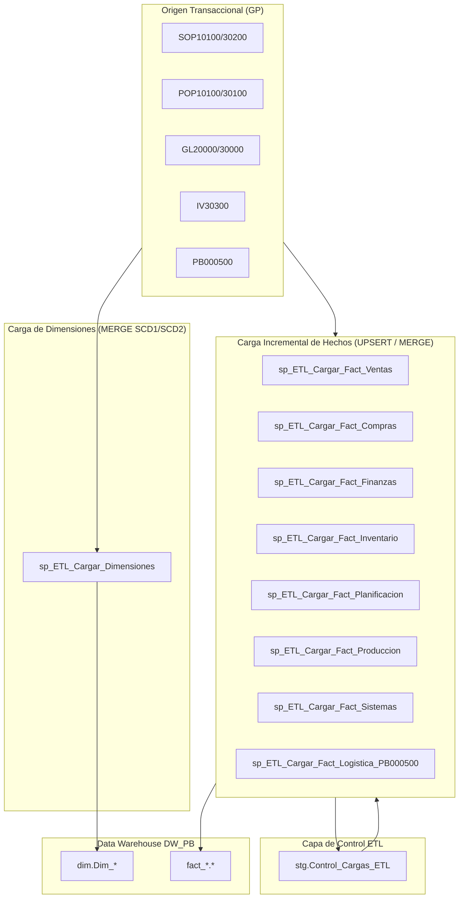

# Plan de Diseño E Implementación de ETLs Diarios (DW_PB)

Este documento describe la arquitectura y patrones de diseño para las tuberías **ETL / ELT de ejecución diaria** que extraen datos de la base de datos transaccional (Dynamics GP - `script-PB.sql`) y alimentan el Data Warehouse **`DW_PB`**.

---

## 🛡️ Principios Clave del Diseño ETL

> [!IMPORTANT]
> **Idempotencia y No Duplicación:**
> Cada procedimiento ETL está diseñado para ejecutarse repetidamente sin generar registros duplicados ni alterar la consistencia de los datos.
> - **Dimensiones:** Uso del patrón `MERGE` (SCD Type 1 para actualización in situ de atributos cambiantes y SCD Type 2 para histórico de clientes).
> - **Tablas de Hechos:** Uso del patrón `MERGE` / `UPSERT` basado en las claves de negocio origen (`Business Keys`), tales como `SOPTYPE + SOPNUMBE + LNITMSEQ` (Ventas), `JRNENTRY + SQNCLINE` (Contabilidad), o `SOPTYPE + SOPNUMBE` (Entrega de Facturas `PB000500`).
> - **Control de Marcas de Agua (Watermarking):** Tabla de control `stg.Control_Cargas_ETL` para registrar la fecha/hora de última extracción por cada Data Mart y optimizar las consultas incrementales diarias.

---

## 📐 Arquitectura del Pipeline ETL Diario

---

## 📋 Estructura de Scripts a Desarrollar

### 1. `sql/02_etl_staging_schemas.sql`
- Creación del esquema `stg`.
- Tabla de auditoría y control de cargas: `stg.Control_Cargas_ETL` (Registra `Proceso_Nombre`, `Fecha_Ultima_Ejecucion`, `Registros_Insertados`, `Registros_Actualizados`, `Estado`).

### 2. `sql/03_etl_dimensiones.sql`
- Procedimiento Almacenado `sp_ETL_Cargar_Dimensiones`:
  - `Dim_Tiempo`: Poblamiento generador de calendario (años pasados + futuros).
  - `Dim_Empresa`, `Dim_Usuario`, `Dim_Cliente`, `Dim_Proveedor`, `Dim_Producto`, `Dim_Cuenta_Contable`, `Dim_Centro_Costo`, `Dim_Almacen`, `Dim_Metodo_Envio`.
  - Implementación con `MERGE INTO dim.Dim_* AS Target USING (Origen) AS Source ON Target.Key = Source.Key WHEN MATCHED THEN UPDATE WHEN NOT MATCHED THEN INSERT`.

### 3. `sql/04_etl_fact_tables.sql`
- Procedimientos Almacenados de Carga Incremental para los 8 Data Marts:
  - `sp_ETL_Cargar_Fact_Ventas`: Extrae `SOP10100`/`SOP10200` y `SOP30200`/`SOP30300`.
  - `sp_ETL_Cargar_Fact_Compras`: Extrae `POP10100`/`POP10110` y `POP30100`/`POP30110`.
  - `sp_ETL_Cargar_Fact_Finanzas`: Extrae `GL20000` y `GL30000`.
  - `sp_ETL_Cargar_Fact_Inventario`: Extrae `IV30300`.
  - `sp_ETL_Cargar_Fact_Planificacion`: Extrae `MRP1000` y `BM00101`.
  - `sp_ETL_Cargar_Fact_Produccion`: Extrae `MOP1000` y `WO010116`.
  - `sp_ETL_Cargar_Fact_Sistemas`: Extrae `SY04900` y `WF30100`.
  - `sp_ETL_Cargar_Fact_Logistica`: Extrae `SOP10100`, `SVC00700` y **`PB000500`** (`Fact_Entrega_Facturas_Cliente`).

### 4. `sql/05_etl_orquestacion_diaria.sql`
- Procedimiento Maestro `sp_ETL_Ejecutar_Carga_Diaria`:
  - Ejecución en bloque con transacciones `BEGIN TRANSACTION` / `COMMIT` y manejo de errores `TRY...CATCH`.
  - Configurable para ser agendado en el **SQL Server Agent Job** (Ejecución diaria programada a las 02:00 AM).

---

## 🧪 Plan de Verificación

1. **Prueba de Carga Inicial (First Run / Full Load):** Ejecutar los procedimientos en una base `DW_PB` vacía y verificar que los conteos de registros coincidan con la BD origen `PB`.
2. **Prueba de Carga Incremental Diaria (Second Run / No-Op Check):** Ejecutar el ETL por segunda vez sin cambios en el origen y confirmar que 0 registros se dupliquen.
3. **Prueba de Actualización de Cambios (Update Test):** Simular la modificación de una fecha de entrega en `PB000500` (`DATE1`) o `DocDueDate` y verificar que el ETL actualice la fila existente en `Fact_Entrega_Facturas_Cliente` sin crear un duplicado.

---

## ❓ Pregunta de Confirmación

> [!IMPORTANT]
> ¿Estás de acuerdo con este plan técnico para proceder a generar los scripts de Procedimientos Almacenados ETL (`sql/02_etl_staging_schemas.sql`, `sql/03_etl_dimensiones.sql`, `sql/04_etl_fact_tables.sql` y `sql/05_etl_orquestacion_diaria.sql`)?
