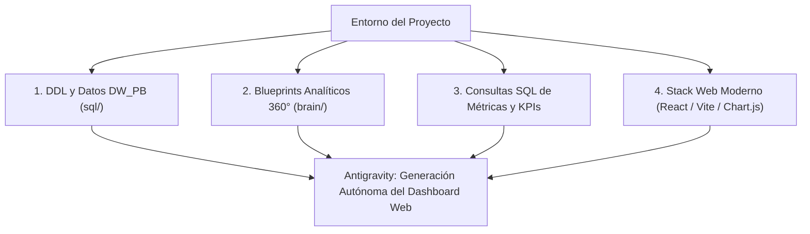

# Guía de Generación de Dashboards Web por IA (Antigravity BI Suite)

Este documento detalla el paquete de contexto y el plan de acción para que la Inteligencia Artificial **Antigravity** construya automáticamente una **Aplicación Web Moderna e Interactiva de Inteligencia de Negocios (Web BI Dashboard Suite)** sobre la BD `DW_PB`.

---

## 🚀 ¿Por qué utilizar Antigravity para crear tus Dashboards?

A diferencia de las herramientas tradicionales como Power BI o Tableau, utilizar **Antigravity** para desarrollar una solución Web de BI ofrece:
1. **Acceso Directo al Código y Base de Datos:** Antigravity puede consultar la base de datos SQL Server `DW_PB` en tiempo real o consumir datos agregados en JSON.
2. **Personalización Total sin Límites de Licenciamiento:** Interfaz web ultrarrápida, responsive y responsiva, utilizable desde navegadores, tablets o dispositivos móviles sin costo de licencias por usuario.
3. **Diseño de Altísima Calidad Estética:** Estilo futurista modo oscuro (Glassmorphism), micro-animaciones, gráficos dinámicos interactivos y tableros en tiempo real.

---

## 📋 Información que Requiere Antigravity (¡Ya Disponible en el Proyecto!)

Si deseas solicitar la construcción a Antigravity, el contexto necesario ya se encuentra 100% preparado en el workspace:

---

## 🎨 Especificación de la Aplicación Web a Generar

### 1. Arquitectura Técnica
- **Frontend**: HTML5 + Vanilla JS / React + Vite.
- **Librería de Gráficos**: **ECharts** o **Chart.js** (Soporte interactivo para Waterfall, Pareto, Gauges, Treemaps y Scatter Plots).
- **Estilos CSS**: CSS3 Moderno con variables CSS (Tokens de diseño), Glassmorphism, degradados elegantes y modo oscuro profesional (Dark Mode Theme).

### 2. Estructura de Módulos Interactivos
1. **🌐 Executive Overview (Resumen CEO):** Tarjetas KPI consolidadas de Ventas ($ USD), Margen %, Compras, EBITDA, OEE de Planta y Salud del Stock.
2. **📈 Módulo Comercial & Ventas:** Embudo de conversión, Matriz BCG de Productos, Ranking Pareto de Clientes y Selector de Moneda (USD / VEF).
3. **🚚 Módulo Compras & Proveedores:** Gasto total por proveedor, Evaluación Fill Rate %, PPV de Costos y Términos de Pago.
4. **💰 Módulo Finanzas & P&L:** Gráfico de Cascada del Estado de Ganancias y Pérdidas, Balance General y Ciclo de Conversión de Efectivo (CCC).
5. **⚙️ Módulo Producción & OEE:** Medidor OEE de Planta, Tasa de Scrap/Mermas y Comparativo Horas Hombre Estimadas vs. Reales.
6. **📦 Módulo Inventario & Cobertura:** Valorización del Stock, Días de Cobertura (DOH), Matriz de Salud de Stock y Clasificación ABC.
7. **🛠️ Módulo Gobernanza de TI:** Monitor SLA de Cargas ETL, Auditoría de Errores y Crecimiento de Tablas.

---

## ⚡ Indicación Directa para Iniciar la Construcción con Antigravity

Puedes indicarle a Antigravity la siguiente instrucción simple para iniciar la construcción:

> *"Antigravity, por favor procede a construir la Aplicación Web del Dashboard Interactivo basada en los 6 blueprints analíticos creados para DW_PB. Utiliza HTML, JS y CSS en modo oscuro con Chart.js / ECharts."*
