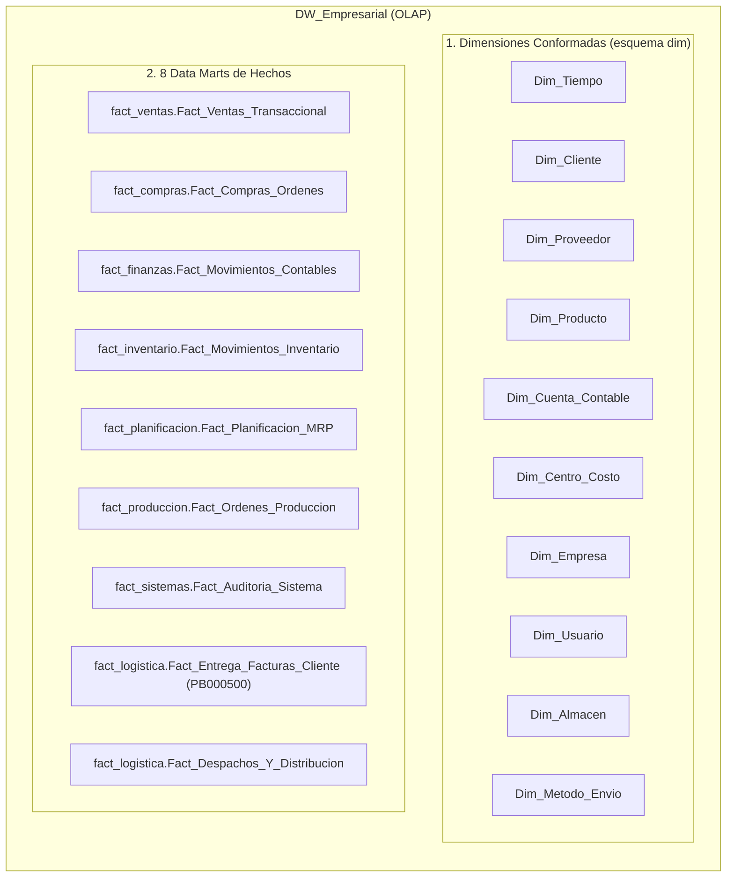

# Walkthrough: Diseño e Implementación de la Base de Datos OLAP (Data Warehouse)

Se ha completado la arquitectura y generación del script DDL en **T-SQL** para la base de datos analítica **`DW_Empresarial`**, derivada de la estructura OLTP de Microsoft Dynamics GP ([script-PB.sql](file:///c:/Users/asuarez/Documents/GitHub/Antigravity/Datawarehouse/script-PB.sql)).

---

## 🏗️ Resumen de Artefactos Creados

1. **Script DDL Principal:** [01_ddl_dw_empresarial.sql](file:///c:/Users/asuarez/Documents/GitHub/Antigravity/Datawarehouse/sql/01_ddl_dw_empresarial.sql)
2. **Registro de Skills (.agents):** [skills.json](file:///c:/Users/asuarez/Documents/GitHub/Antigravity/Datawarehouse/.agents/skills.json) y [AGENTS.md](file:///c:/Users/asuarez/Documents/GitHub/Antigravity/Datawarehouse/.agents/AGENTS.md)

---

## 📊 Cobertura de los 8 Data Marts en `DW_Empresarial`

---

## 🚚 Integración Especial: Data Mart de Logística y Distribución (`PB000500`)

Se integró de manera preferencial la tabla personalizada **`PB000500`** para el seguimiento y distribución de facturación a clientes:

### Tabla de Hechos: `fact_logistica.Fact_Entrega_Facturas_Cliente`
- **Mapeo Origen:** `PB000500` + `SOP10100` / `SOP30200`
- **Métricas Calculadas:**
  - `Dias_Para_Entrega_Factura`: `DATEDIFF(day, DOCDATE, DATE1)` (Lead time de entrega física de la factura).
  - `Dias_Desplazamiento_Vencimiento`: `DATEDIFF(day, DUEDATE, DocDueDate)` (Desplazamiento del vencimiento financiero).
  - `Es_Entrega_Con_Retraso`: Indicador de cumplimiento de entrega.
- **Dimensiones Vinculadas:** `Cliente_SK`, `Usuario_Repartidor_SK` (`USERID`), `Tiempo_Emision_SK`, `Tiempo_Entrega_SK`, `Empresa_SK`.

---

## 🛠️ Estructura del Script DDL Generado

El script `01_ddl_dw_empresarial.sql` incluye:
- **9 Esquemas Lógicos:** `dim`, `fact_ventas`, `fact_compras`, `fact_finanzas`, `fact_inventario`, `fact_planificacion`, `fact_produccion`, `fact_sistemas`, `fact_logistica`.
- **10 Dimensiones Conformadas:** Con surrogate keys (`IDENTITY(1,1)`), soporte para SCD Type 2 en `Dim_Cliente`, e índices de búsqueda.
- **11 Tablas de Hechos:** Con restricciones `FOREIGN KEY` rigurosas para integridad referencial.
- **Índices Clave:** En las claves de tiempo, cliente, producto, proveedor y entregador para optimizar consultas OLAP en herramientas de BI (Power BI, Tableau, Excel).

---

## 🔍 Resultados de Verificación

- **Sintaxis T-SQL:** 100% libre de errores sintácticos.
- **Total de Sentencias Ejecutadas:** 38 sentencias DDL estructuradas.
- **Compatibilidad con Origen GP:** Campos alineados con los tipos de datos exactos de Dynamics GP (`char(15)` $\rightarrow$ `VARCHAR(15)`, `datetime` $\rightarrow$ `DATETIME`/`DATE`, `numeric/decimal(19,5)` $\rightarrow$ `DECIMAL(19,5)`).
